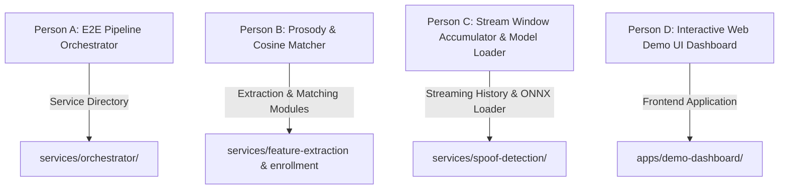

# Team Delegation & AI Agent Prompt Packets
## Voice Integrity & Impersonation Prevention Platform

This document divides all remaining work into **4 completely independent work packages** for 4 developers. Each prompt is self-contained, specifies strict file boundaries to prevent conflicts, includes hard anti-hallucination guardrails, and can be **directly copied and pasted into any AI coding agent** (Cursor, Antigravity, Claude Code, GitHub Copilot Workspace, Devin, Aider, etc.).

---

# 📌 Division of Work Overview



| Person | Focus Area | Directory Scope (No Overlaps) | Target Output |
|---|---|---|---|
| **Person A** | E2E Pipeline Orchestrator | `services/orchestrator/` | Central FastAPI service connecting all 6 microservices |
| **Person B** | Prosody & Cosine Speaker Matcher | `services/feature-extraction-service/app/prosody.py`<br>`services/enrollment-service/app/matcher.py` | F0 pitch contour, jitter, and cosine embedding distance |
| **Person C** | Streaming Accumulator & Model Loader | `services/spoof-detection-service/app/accumulator.py`<br>`services/spoof-detection-service/app/model_loader.py` | 3s sliding-window EWMA risk accumulator & ONNX model loader |
| **Person D** | Interactive Web Demo UI Dashboard | `apps/demo-dashboard/` | Real-time visual risk gauge, audio visualizer & policy editor |

---

# 🤖 PROMPT PACKET 1 (For Person A)

### 📋 COPY-PASTE THIS EXACT PROMPT TO YOUR AI AGENT:

```text
================================================================================
           AI AGENT PROMPT: PERSON A - E2E PIPELINE ORCHESTRATOR
================================================================================

PROJECT: Voice Integrity & Impersonation Prevention Platform
TARGET DIRECTORY: services/orchestrator/ (New directory — do not touch other services)

OBJECTIVE:
Build `services/orchestrator`, a FastAPI microservice that orchestrates the end-to-end flow across all existing platform services. It receives incoming call audio payloads and metadata, queries downstream microservices, computes the fused risk assessment, and triggers alerts.

ARCHITECTURE FLOW TO IMPLEMENT:
Incoming Payload (audio PCM base64, session_id, tenant_id, subject_id, context_score)
  ├── 1. Call `feature-extraction-service` (http://localhost:8001/v1/extract) -> Get log_mel & speaker_embedding
  ├── 2. Parallel Step:
  │      ├── Call `spoof-detection-service` (http://localhost:8002/v1/detect) -> Get synthesis_signal
  │      └── Call `enrollment-service` (http://localhost:8003/v1/tenants/.../status) -> Compare embedding to get speaker_match_signal
  ├── 3. Call `risk-fusion-engine` (http://localhost:8000/v1/assess) -> Get fused RiskAssessmentResponse
  ├── 4. Call `policy-threshold-engine` (http://localhost:8004/v1/evaluate) -> Get final PolicyDecision
  └── 5. Call `alerting-service` (http://localhost:8005/v1/events) -> Dispatch notification event

REQUIREMENTS & INVARIANTS:
1. FAIL-SAFE DESIGN: If any downstream service fails or times out, set signal `available: false` or `degraded: true`. NEVER default missing data to risk score 0.0. Return `RECOMMEND_CALLBACK_VERIFICATION`.
2. ZERO AUDIO RETENTION: Process audio in-memory; do not write raw audio to disk or persist audio_bytes fields.
3. API ENDPOINTS:
   - `POST /v1/pipeline/process` -> Runs full pipeline, returns complete orchestrator response.
   - `GET /healthz` -> Returns {"status": "ok"}.
4. STRUCTURAL BOUNDARIES: Write all code strictly inside `services/orchestrator/app/` (main.py, client.py, models.py) and tests inside `services/orchestrator/tests/test_pipeline.py`.
5. REQUIREMENTS: Include `requirements.txt` containing fastapi, pydantic, httpx, uvicorn, pytest.

VERIFICATION:
Create `tests/test_pipeline.py` using httpx/respx mock fixtures for downstream services. Run `python -m pytest tests/ -v` and ensure 100% of tests pass cleanly.
================================================================================
```

---

# 🤖 PROMPT PACKET 2 (For Person B)

### 📋 COPY-PASTE THIS EXACT PROMPT TO YOUR AI AGENT:

```text
================================================================================
    AI AGENT PROMPT: PERSON B - PROSODY EXTRACTOR & COSINE SPEAKER MATCHER
================================================================================

PROJECT: Voice Integrity & Impersonation Prevention Platform
TARGET FILES:
- `services/feature-extraction-service/app/prosody.py`
- `services/enrollment-service/app/matcher.py`

OBJECTIVE:
Fulfill the "Prosody & Behavioral Analysis" and "Cross-Session Speaker Verification" requirements by implementing dedicated signal analysis modules.

MODULE 1: Prosody Extractor (`services/feature-extraction-service/app/prosody.py`)
1. Implement `extract_prosody_features(pcm_bytes: bytes, sample_rate: int = 16000) -> ProsodyFeatures`:
   - Calculate F0 fundamental frequency contour estimate using autocorrelation/spectral peaks.
   - Calculate pitch variance (`pitch_variance`), jitter estimate (`jitter_estimate`), and silence pause ratio (`pause_ratio`).
2. Integrate into `services/feature-extraction-service/app/extraction.py` by adding optional `prosody: Optional[ProsodyFeatures]` to `ExtractionResponse`.

MODULE 2: Cosine Speaker Matcher (`services/enrollment-service/app/matcher.py`)
1. Implement `compute_speaker_match_signal(live_embedding: list[float], enrolled_embedding: list[float]) -> RiskSignal`:
   - Compute Cosine Similarity:
     cos_sim = dot(v1, v2) / (norm(v1) * norm(v2))
   - Map similarity to mismatch score:
     mismatch_score = max(0.0, min(1.0, (1.0 - cos_sim) / 2.0))
   - Return a `RiskSignal` dict matching `RiskSignal` proto shape (score, confidence, available=True, detail).
2. If `enrolled_embedding` is empty/missing, return `RiskSignal(score=0.5, confidence=0.0, available=False, detail="No enrolled voiceprint on file")`.

REQUIREMENTS & INVARIANTS:
1. Do not persist raw audio bytes.
2. Maintain `available: false` fail-safe when enrolled embedding is absent.
3. Write test files:
   - `services/feature-extraction-service/tests/test_prosody.py`
   - `services/enrollment-service/tests/test_matcher.py`

VERIFICATION:
Run `python -m pytest tests/ -v` inside both `services/feature-extraction-service` and `services/enrollment-service` directories and verify all tests pass cleanly.
================================================================================
```

---
4
# 🤖 PROMPT PACKET 3 (For Person C)

### 📋 COPY-PASTE THIS EXACT PROMPT TO YOUR AI AGENT:

```text
================================================================================
 AI AGENT PROMPT: PERSON C - STREAM WINDOW ACCUMULATOR & MODEL LOADER
================================================================================

PROJECT: Voice Integrity & Impersonation Prevention Platform
TARGET FILES:
- `services/spoof-detection-service/app/accumulator.py`
- `services/spoof-detection-service/app/model_loader.py`

OBJECTIVE:
Implement a continuous 3-second sliding window risk accumulator for streaming calls, and a model loader interface for ONNX/PyTorch deepfake detection weights.

MODULE 1: Streaming Risk Accumulator (`services/spoof-detection-service/app/accumulator.py`)
1. Implement `StreamWindowAccumulator`:
   - Maintains a thread-safe rolling history of recent audio chunk risk scores for each `call_session_id` (window size: 3 seconds / 10 chunks).
   - Computes exponentially weighted moving average (EWMA) risk score:
     EWMA_t = alpha * score_t + (1 - alpha) * EWMA_{t-1}
   - Returns aggregated risk trend (`RISING`, `STABLE`, `FALLING`) and peak risk score.

MODULE 2: Pretrained Model Loader (`services/spoof-detection-service/app/model_loader.py`)
1. Implement `PretrainedModelLoader` interface:
   - Supports loading model weights / ONNX runtime sessions for deepfake detection models (Wav2Vec2 / AASIST).
   - Serves as a concrete provider backend for `StubModelRegistry` in `services/spoof-detection-service/app/model_registry.py`.
2. Fail-Safe: If model file fails to load, fallback to `available=False` rather than throwing uncaught exception.

REQUIREMENTS & INVARIANTS:
1. Maintain thread safety for `StreamWindowAccumulator` using `threading.Lock`.
2. Ensure fail-safe default: model loading failure returns `available: false` (never fail open).
3. Write test files:
   - `services/spoof-detection-service/tests/test_accumulator.py`
   - `services/spoof-detection-service/tests/test_model_loader.py`

VERIFICATION:
Run `python -m pytest tests/ -v` inside `services/spoof-detection-service` and verify 100% test pass status.
================================================================================
```

---

# 🤖 PROMPT PACKET 4 (For Person D)

### 📋 COPY-PASTE THIS EXACT PROMPT TO YOUR AI AGENT:

```text
================================================================================
     AI AGENT PROMPT: PERSON D - INTERACTIVE WEB DEMO UI DASHBOARD
================================================================================

PROJECT: Voice Integrity & Impersonation Prevention Platform
TARGET DIRECTORY: apps/demo-dashboard/ (New directory — do not touch python microservices)

OBJECTIVE:
Build a premium, modern Web UI Dashboard (`apps/demo-dashboard`) for SIH presentation and live demonstration of the Voice Integrity Platform.

KEY FEATURES TO BUILD:
1. LIVE RISK METER GAUGE:
   - Animated SVG/Canvas circular risk gauge (0.00 to 1.00 score).
   - Dynamic color transition: Green (0.0-0.39) -> Yellow (0.40-0.69) -> Red (0.70-1.00).
2. REAL-TIME SIGNAL BREAKDOWN:
   - Visual cards with progress bars for:
     - Synthesis Signal (AI Fake Probability)
     - Speaker Match Signal (Voiceprint Mismatch)
     - Contextual Signal (Transaction Risk)
3. ACTION RECOMMENDATION BANNER:
   - Highlights required response: `PROCEED`, `RECOMMEND_CALLBACK_VERIFICATION`, `RECOMMEND_MFA_STEP_UP`, `RECOMMEND_SUPERVISOR_ESCALATION`, or `BLOCK_PENDING_VERIFICATION`.
   - Displays full human-readable explanation string.
4. SIMULATION & TEST CONTROLS:
   - Buttons to simulate: "Clean Customer Call", "AI Voice Clone Attack", "Unknown Speaker Call", "High-Value Transaction".
   - Tenant Policy Configuration Panel (slider for thresholds, toggle for auto_block_enabled).
   - Live Audit Trail Log table.

TECHNICAL STACK:
- Standalone HTML5 / Vanilla CSS / JavaScript (or Vite React).
- Uses Fetch API to send requests to `http://localhost:8000/v1/assess` and `http://localhost:8004/v1/evaluate`.
- Dark mode glassmorphism theme with modern typography (Inter / Outfit font).

DELIVERABLES:
- `apps/demo-dashboard/index.html`
- `apps/demo-dashboard/styles.css`
- `apps/demo-dashboard/app.js`
- `apps/demo-dashboard/README.md` (instructions to open or serve via `python -m http.server 3000`)
================================================================================
```
