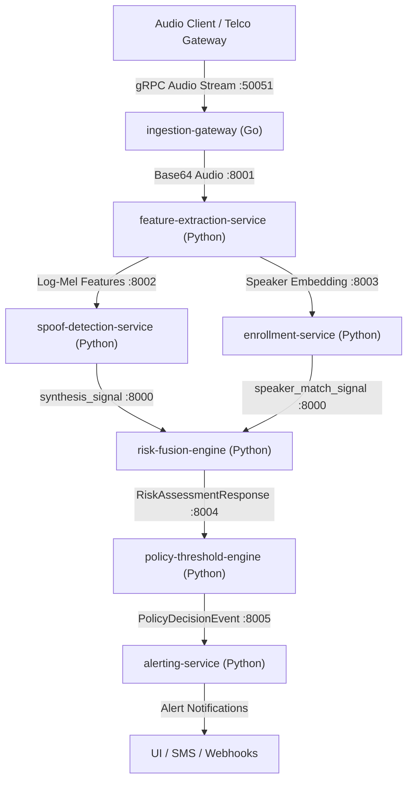

# Developer & AI Agent Operations Guide
### Voice Integrity & Impersonation Prevention Platform

This guide provides complete instructions for developers (humans) and AI coding agents (like Antigravity) to setup, run, test, and extend all microservices and SDKs in this platform.

---

## 📐 Architecture Overview



---

## 🛠️ Prerequisites

| Technology | Minimum Version | Used For |
|---|---|---|
| **Python** | 3.10+ | FastAPI microservices & Python SDK |
| **Go** | 1.22+ | gRPC streaming `ingestion-gateway` |
| **Node.js** | 22+ (with native test runner & type stripping) | Node.js TypeScript SDK |
| **Docker & Docker Compose** | 24.0+ | Multi-container local execution |

---

## 🔌 Service Network Allocation Map

| Service Name | Stack | Primary Port | Protocol / Path | Purpose |
|---|---|---|---|---|
| **ingestion-gateway** | Go / gRPC | `50051` (gRPC), `8080` (HTTP) | `voiceintegrity.v1.IngestionGateway` | High-concurrency audio chunk streaming & backpressure |
| **risk-fusion-engine** | Python / FastAPI | `8000` | `POST /v1/assess` | Fuses acoustic & context signals into deterministic risk score |
| **feature-extraction-service** | Python / FastAPI | `8001` | `POST /v1/extract` | Converts raw audio into spectral features & speaker embeddings |
| **spoof-detection-service** | Python / FastAPI | `8002` | `POST /v1/detect` | AI-synthesis & deepfake voice cloning detection |
| **enrollment-service** | Python / FastAPI | `8003` | `POST /v1/tenants/{id}/enroll` | Multi-session voiceprint registration & liveness verification |
| **policy-threshold-engine** | Python / FastAPI | `8004` | `POST /v1/evaluate` | Tenant-configurable threshold rules & opt-in auto-block gate |
| **alerting-service** | Python / FastAPI | `8005` | `POST /v1/events`, `GET /v1/.../alerts` | Idempotent multi-channel alert dispatcher |

---

## 🚀 Step-by-Step Local Startup Guide

### Option 1: Run All Services via Docker Compose (Recommended)

To start the entire environment with a single command:

```bash
docker-compose up --build
```

---

### Option 2: Run Services Individually (Terminal Commands)

#### 1. Ingestion Gateway (Go)
```bash
cd services/ingestion-gateway
go run ./cmd/server
```

#### 2. Risk Fusion Engine (Python)
```bash
cd services/risk-fusion-engine
pip install -r requirements.txt
python -m uvicorn app.main:app --reload --port 8000
```

#### 3. Feature Extraction Service (Python)
```bash
cd services/feature-extraction-service
pip install -r requirements.txt
python -m uvicorn app.main:app --reload --port 8001
```

#### 4. Spoof Detection Service (Python)
```bash
cd services/spoof-detection-service
pip install -r requirements.txt
python -m uvicorn app.main:app --reload --port 8002
```

#### 5. Enrollment Service (Python)
```bash
cd services/enrollment-service
pip install -r requirements.txt
python -m uvicorn app.main:app --reload --port 8003
```

#### 6. Policy Threshold Engine (Python)
```bash
cd services/policy-threshold-engine
pip install -r requirements.txt
python -m uvicorn app.main:app --reload --port 8004
```

#### 7. Alerting Service (Python)
```bash
cd services/alerting-service
pip install -r requirements.txt
python -m uvicorn app.main:app --reload --port 8005
```

---

## 🧪 Comprehensive Verification & Test Suite

Run these exact terminal commands to run all test suites across the platform:

```bash
# 1. Risk Fusion Engine (8 property-based & safety tests)
cd services/risk-fusion-engine && python -m pytest tests/ -v

# 2. Feature Extraction Service (14 privacy & performance tests)
cd services/feature-extraction-service && python -m pytest tests/ -v

# 3. Spoof Detection Service (43 accent & detection tests)
cd services/spoof-detection-service && python -m pytest tests/ -v

# 4. Enrollment Service (45 authorization & liveness tests)
cd services/enrollment-service && python -m pytest tests/ -v

# 5. Policy Threshold Engine (37 liability & audit tests)
cd services/policy-threshold-engine && python -m pytest tests/ -v

# 6. Alerting Service (32 idempotency & channel tests)
cd services/alerting-service && python -m pytest tests/ -v

# 7. Ingestion Gateway (6 load & gRPC streaming tests)
cd services/ingestion-gateway && go test -v ./...

# 8. Python SDK Client (3 tests)
cd sdk/python && python -m pytest tests/ -v

# 9. Node.js TypeScript SDK Client (3 tests)
cd sdk/node && npm test
```

---

## 🤖 Instructions & Hard Constraints for AI Coding Agents

When working on or modifying code in this repository, **all AI Agents MUST strictly adhere to these invariants**:

### 1. Fail-Safe Principle (DESIGN.md §3)
- **Never Fail Open:** On dependency failure, timeout, or missing signals, the system MUST return `available: false` or `degraded: true` with a cautious recommendation (`RECOMMEND_CALLBACK_VERIFICATION`).
- An unavailable signal is **never** treated as score `0.0` ("safe").

### 2. Privacy & Audio Non-Retention (DESIGN.md §7)
- **Raw audio MUST NEVER be stored on disk or written to databases.**
- Audio bytes exist in memory only for the duration of feature extraction.
- Models and dataclasses must never include a persisted `audio_bytes` field. All tests in `test_privacy.py` and `test_no_raw_audio.py` must pass.

### 3. Liability Boundary & Opt-In Auto-Block (DESIGN.md §4.7)
- `auto_block_enabled` MUST default to `False` for every tenant.
- A tenant with `auto_block_enabled=False` MUST **NEVER** receive `BLOCK_PENDING_VERIFICATION`, regardless of risk score (including `1.0`).

### 4. Deterministic Scoring & Noisy-OR Fusion
- Acoustic signals (synthesis detection & speaker mismatch) use **Noisy-OR** combination so one strong threat signal is not diluted by averaging.
- Contextual risk acts strictly as a **bounded multiplier (0.85x – 1.35x)** and cannot drive high risk alone.

### 5. Protected Files
- `services/risk-fusion-engine/app/fusion.py` is the audited compliance core. **Do not modify fusion logic without explicit human approval.**

---

## 📡 End-to-End Verification Pipeline Walkthrough (cURL / API)

### 1. Extract Features from Audio Chunk
```bash
curl -X POST http://localhost:8001/v1/extract \
  -H "Content-Type: application/json" \
  -d '{
    "request_id": "req-001",
    "tenant_id": "bank-acme",
    "audio_bytes": "AAAAAA=="
  }'
```

### 2. Detect AI Voice Spoofing
```bash
curl -X POST http://localhost:8002/v1/detect \
  -H "Content-Type: application/json" \
  -d '{
    "call_session_id": "sess-001",
    "tenant_id": "bank-acme",
    "audio_features": [0.1, 0.4, 0.8, 0.2]
  }'
```

### 3. Compute Fused Risk Score
```bash
curl -X POST http://localhost:8000/v1/assess \
  -H "Content-Type: application/json" \
  -d '{
    "call_session_id": "sess-001",
    "tenant_id": "bank-acme",
    "synthesis_signal": {"score": 0.85, "confidence": 0.90, "available": true},
    "speaker_match_signal": {"score": 0.70, "confidence": 0.80, "available": true},
    "contextual_signal": {"score": 0.60, "confidence": 0.75, "available": true}
  }'
```

### 4. Evaluate Policy Rules
```bash
curl -X POST http://localhost:8004/v1/evaluate \
  -H "Content-Type: application/json" \
  -d '{
    "tenant_id": "bank-acme",
    "assessment": {
      "call_session_id": "sess-001",
      "risk_score": 0.98,
      "confidence": 0.80,
      "actions": ["RECOMMEND_CALLBACK_VERIFICATION", "RECOMMEND_SUPERVISOR_ESCALATION"],
      "explanation": "high risk (0.98): synthesis artifacts detected",
      "evaluated_at": "2026-08-28T12:00:00Z",
      "degraded": false
    }
  }'
```

### 5. Dispatch Alert
```bash
curl -X POST http://localhost:8005/v1/events \
  -H "Content-Type: application/json" \
  -d '{
    "event_id": "evt-100",
    "call_session_id": "sess-001",
    "tenant_id": "bank-acme",
    "action": "RECOMMEND_SUPERVISOR_ESCALATION",
    "risk_score": 0.98,
    "explanation": "high risk (0.98): synthesis artifacts detected"
  }'
```
