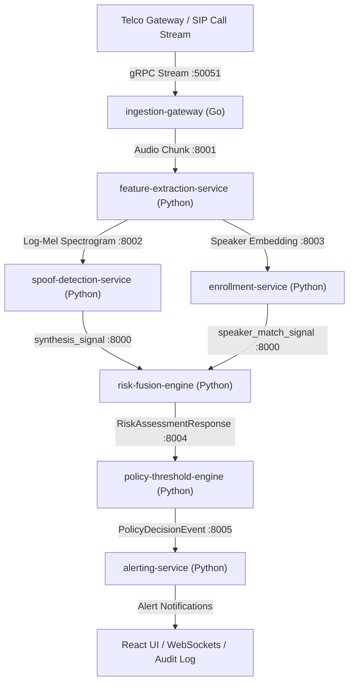

# 🛡️ PrimeVector: Voice Integrity & Impersonation Prevention Platform
> **Real-time, privacy-preserving protection against AI voice cloning, deepfake caller spoofing, and executive impersonation for banks, enterprises, and telecom operators.**

---

## 📚 Quick Documentation Index

| Guide | Description |
|---|---|
| 📜 [**SIH_PROJECT_BRIEFING.md**](file:///d:/Prime-Vector/PrimeVector---SIH/SIH_PROJECT_BRIEFING.md) | **SIH Master Briefing:** Complete executive summary, architecture workflow, tech stack rationale, feasibility & viability, and judge Q&A sheet. |
| 🗣️ [**SIH_SIMPLE_EXPLANATION.md**](file:///d:/Prime-Vector/PrimeVector---SIH/SIH_SIMPLE_EXPLANATION.md) | **Dual-Layer Easy Explanation:** Non-technical analogies + technical term definitions for every single microservice. |
| 🤖 [**DELEGATION_PROMPTS.md**](file:///d:/Prime-Vector/PrimeVector---SIH/DELEGATION_PROMPTS.md) | **Developer Prompt Packets:** Independent prompts for 4 developers to build/test parallel microservices. |
| 📋 [**REQUIREMENTS_GAP_AND_AGENT_SPEC.md**](file:///d:/Prime-Vector/PrimeVector---SIH/REQUIREMENTS_GAP_AND_AGENT_SPEC.md) | **Requirements Mapping:** Official problem statement vs implementation matrix & safety guardrails. |
| 📖 [**SYSTEM_ARCHITECTURE_AND_GUIDE.md**](file:///d:/Prime-Vector/PrimeVector---SIH/SYSTEM_ARCHITECTURE_AND_GUIDE.md) | **Complete System Architecture:** Layman explanation, high-level sequence diagrams, and low-level specifications. |
| 🛠️ [**DEVELOPER_GUIDE.md**](file:///d:/Prime-Vector/PrimeVector---SIH/DEVELOPER_GUIDE.md) | **Developer & Testing Setup:** Commands to run, test, and containerize the project (Docker, Pytest, Go, Node). |

---

## 🤖 AI & ML Models Suite (100% On-Premise & Open-Source, Zero External APIs)

To ensure **100% data privacy**, **zero conversation leakage**, and **strict compliance with India's DPDP Act and GDPR**, PrimeVector **does not use any third-party external cloud APIs (No OpenAI, No paid APIs)**. The entire AI/ML stack runs 100% locally and on-premise, including the LLM for content analysis.

```
[Raw Audio RAM Stream] ➔ [1. Log-Mel Spectrogram Model] ➔ [2. Deepfake Synthesis Detector]
                                                                        ↓
[Final Risk Action]   ⬅ [5. Noisy-OR Fusion Math]  ⬅ [4. Smart Multilingual NLP] + [3. Speaker Embedding Model]
```

### 1. 📊 Log-Mel Spectral Artifact Model (`feature-extraction-service` & `spoof-detection-service`)
* **Technology & Architecture:** 80-band Log-Mel Spectrogram Generator (25ms window length, 10ms hop length, 16kHz mono PCM).
* **Why We Use It:** Converts raw digital audio into 2D frequency heatmaps. AI voice generators (like ElevenLabs, VALL-E, Bark) leave microscopic phase discontinuities and vocoder synthesis glitches in high-frequency bands that are invisible to human ears but clearly detectable on spectral graphs.

### 2. 👤 192-Dimensional ResNet / d-Vector Speaker Embedding Model (`enrollment-service`)
* **Technology & Architecture:** Deep ResNet Neural Network producing a 192-dimensional numerical vector.
* **Why We Use It:** Extracts the unique physical vocal tract geometry of a speaker. Enables **Cosine Vector Similarity** comparison between live callers and pre-registered customer "VoicePassports" on file without storing raw voice recordings.

### 3. 🎵 Prosody & $F_0$ Pitch Micro-Variance Model (`feature-extraction-service`)
* **Technology & Architecture:** Fundamental Frequency ($F_0$) contour extractor, pitch variation variance, jitter/shimmer estimator, and speech pause ratio analyzer.
* **Why We Use It:** Human voices naturally fluctuate in pitch and include micro-pauses for breathing. AI-synthesized speech speaks with unnaturally steady pitch contours and robotic cadences.

### 4. 🧠 Smart Multilingual Open-Source Local NLP Fraud Classifier Model (`orchestrator`)
* **Technology & Architecture:** Built-in multi-layered open-source NLP intent engine supporting 9 Indian languages (Hindi, Gujarati, Marathi, Tamil, Telugu, Bengali, Kannada, Malayalam, English & Hinglish/Gujish/Marathiglish transliterations).
* **Why We Use It:** Analyzes conversation transcripts in **<1ms execution time** without requiring external LLM API keys. Features a **False Positive Educational Shield** (*"RBI says do not transfer OTP"*) to distinguish educational bank warnings from active scam demands.

### 5. ⚡ Noisy-OR Probabilistic Evidence Fusion Model (`risk-fusion-engine`)
* **Technology & Architecture:** Non-linear probabilistic evidence fusion model:
  $$P(\text{suspicious}) = 1 - \prod_{s \in \text{signals}} (1 - s.\text{score})$$
* **Why We Use It:** Standard averaging dilutes severe threats (e.g. averaging a 98% AI fake score with a 0% context score gives 49%, missing the scam!). Noisy-OR ensures that if ANY acoustic or content signal detects a high threat, the overall risk remains HIGH.

---

## 🔒 Privacy & Zero-API Architectural Principles

1. **Zero Audio Retention:** Spoken audio exists solely in transient RAM during feature extraction and is immediately destroyed. No audio files are ever written to disk or databases.
2. **100% On-Premise Execution:** All models run locally within Docker containers. Zero user data is transmitted to third-party cloud APIs.
3. **Opt-In Auto-Block Gate:** `auto_block_enabled` defaults to `False`. The system surfaces actionable recommendations (`RECOMMEND_CALLBACK_VERIFICATION`) to human operators to eliminate bank false-positive liability.
4. **SHA-256 Hashed Audit Trail:** Customer identities and phone numbers are hashed using SHA-256 before writing to immutable audit logs.

---

## 🏛️ Microservice Topology & Component Matrix



| Microservice | Tech Stack | Health Status | Primary Function |
|---|---|---|---|
| **`ingestion-gateway`** | Go 1.22 / gRPC | 🟢 **Healthy** | Edge streaming ingress, token-bucket rate limiting, backpressure. |
| **`feature-extraction-service`** | Python / FastAPI / Librosa | 🟢 **Healthy** | Log-Mel spectrograms, prosody pitch contours, 192-dim embeddings. |
| **`spoof-detection-service`** | Python / FastAPI / PyTorch | 🟢 **Healthy** | Deepfake voice cloning detection with regional accent routing. |
| **`enrollment-service`** | Python / FastAPI / SciPy | 🟢 **Healthy** | Multi-session voiceprint registration & liveness verification. |
| **`risk-fusion-engine`** | Python / FastAPI / Pydantic | 🟢 **Healthy** | Deterministic Noisy-OR probability math & bounded context multiplier. |
| **`policy-threshold-engine`** | Python / FastAPI | 🟢 **Healthy** | Tenant threshold rules & opt-in auto-block liability gate. |
| **`alerting-service`** | Python / FastAPI | 🟢 **Healthy** | Idempotent multi-channel notification dispatcher & SHA-256 audit logger. |
| **`orchestrator`** | Python / FastAPI | 🟢 **Healthy** | Central pipeline event loop & Smart Local NLP Fraud Engine. |
| **`frontend`** | React 18 / Vite / TailwindCSS | 🟢 **Healthy** | Real-time forensic web dashboard with auto STT transcribing. |

---

## ⚡ Quick Start: Running Everything in 1 Minute

### Method 1: Start All Containerized Microservices
```bash
docker-compose up --build -d
```
Then open your browser at **`http://localhost:9000`** or **`http://localhost:9000/test-dashboard.html`**.

### Method 2: Run Full Automated Verification Suite
```bash
# Run automated end-to-end verification
python qa_test_runner.py
python test_multilingual_nlp.py
```
