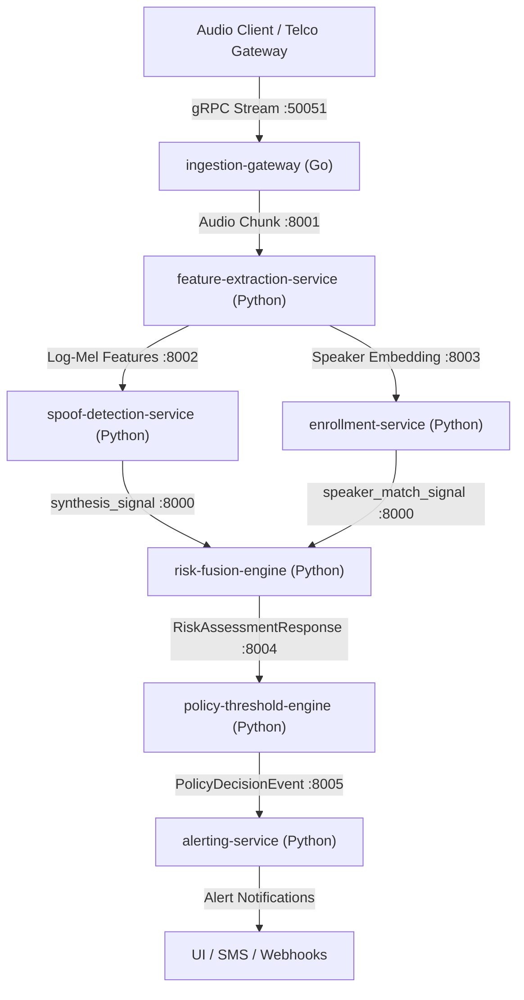

# Voice Integrity & Impersonation Prevention Platform

Real-time protection against AI voice cloning, deepfake caller spoofing, and executive impersonation for banks, enterprises, and telecom operators.

---

## 📚 Quick Documentation Index

| Guide | Description |
|---|---|
| 🤖 [**DELEGATION_PROMPTS.md**](file:///x:/SIH%202k26/DELEGATION_PROMPTS.md) | **4-Person Prompt Packets:** Independent, conflict-free prompts for 4 developers to copy-paste directly into AI agents. |
| 📋 [**REQUIREMENTS_GAP_AND_AGENT_SPEC.md**](file:///x:/SIH%202k26/REQUIREMENTS_GAP_AND_AGENT_SPEC.md) | **Problem Statement Mapping:** Detailed match of official requirements vs codebase, remaining tasks, and anti-hallucination agent rules. |
| 📖 [**SYSTEM_ARCHITECTURE_AND_GUIDE.md**](file:///x:/SIH%202k26/SYSTEM_ARCHITECTURE_AND_GUIDE.md) | **Complete Overview:** Layman explanation, high-level diagrams, and low-level technical architecture for all 7 microservices. |
| 🛠️ [**DEVELOPER_GUIDE.md**](file:///x:/SIH%202k26/DEVELOPER_GUIDE.md) | **Developer & Testing Setup:** Commands to run, test, and containerize the whole project (Docker, Pytest, Go, Node). |
| 🛡️ [**AGENT_INSTRUCTIONS.md**](file:///x:/SIH%202k26/AGENT_INSTRUCTIONS.md) | **AI Agent Guardrails:** Non-negotiable safety rules, protected paths, and prompt templates for AI coding assistants. |
| 📄 [**docs/DESIGN.md**](file:///x:/SIH%202k26/docs/DESIGN.md) | **Core System RFC:** Problem statement, non-goals, scale targets, and design tradeoffs. |

---

## 🏛️ Platform Status: Implemented Microservices & SDKs

All **7 core microservices** and **2 client SDKs** specified in the architecture RFC are fully implemented, containerized, and tested:



| Component | Tech Stack | Status | Primary Function |
|---|---|---|---|
| **ingestion-gateway** | Go 1.22 / gRPC | ✅ **Done** (`go test` pass) | High-concurrency audio chunk streaming & backpressure |
| **risk-fusion-engine** | Python / FastAPI | ✅ **Done** (Hypothesis property tests pass) | Fuses acoustic & context signals into deterministic risk score |
| **feature-extraction-service** | Python / FastAPI | ✅ **Done** (14 tests pass) | Spectral features & speaker embeddings (zero raw audio saved) |
| **spoof-detection-service** | Python / FastAPI | ✅ **Done** (43 tests pass) | AI-synthesis & deepfake voice cloning detection |
| **enrollment-service** | Python / FastAPI | ✅ **Done** (45 tests pass) | Multi-session voiceprint registration & liveness verification |
| **policy-threshold-engine** | Python / FastAPI | ✅ **Done** (37 tests pass) | Tenant-configurable threshold rules & opt-in auto-block gate |
| **alerting-service** | Python / FastAPI | ✅ **Done** (32 tests pass) | Idempotent multi-channel alert dispatcher |
| **Python SDK** | Python Package | ✅ **Done** (3 tests pass) | Native Python client wrapper |
| **Node.js TypeScript SDK** | Node.js TS | ✅ **Done** (3 tests pass) | Native Node.js client wrapper |

---

## ⚡ Quick Start: Running Everything in 1 Minute

### Method 1: Run All Services via Docker Compose
```bash
docker-compose up --build
```

### Method 2: Run Full Automated Verification Suite
```bash
# Test all microservices and SDKs
cd services/risk-fusion-engine && python -m pytest tests/ -v
cd ../feature-extraction-service && python -m pytest tests/ -v
cd ../spoof-detection-service && python -m pytest tests/ -v
cd ../enrollment-service && python -m pytest tests/ -v
cd ../policy-threshold-engine && python -m pytest tests/ -v
cd ../alerting-service && python -m pytest tests/ -v
cd ../ingestion-gateway && go test -v ./...
cd ../../sdk/python && python -m pytest tests/ -v
cd ../node && npm test
```

---

## 🛡️ Hard Safety Invariants (Strictly Enforced)

1. **Never Fail Open:** On network failure, outage, or missing signals, the system degrades to manual verification recommendation (`RECOMMEND_CALLBACK_VERIFICATION`).
2. **Zero Audio Retention:** Raw audio is processed strictly in-memory and discarded. No raw audio is ever persisted to disk or databases.
3. **Opt-In Auto-Block:** `auto_block_enabled` defaults to `False`. The system never unilaterally blocks transactions unless explicitly configured per tenant.
4. **Append-Only Audit Logs:** Audit trails are immutable and recipients are SHA-256 hashed.
