# Requirements Gap Analysis & Anti-Hallucination Agent Directive
## Voice Integrity & Impersonation Prevention Platform

---

# PART 1: Requirements vs. Implementation Mapping

This section maps the official problem statement requirements against the existing codebase to identify what is **Fully Implemented**, **Partially Implemented**, and **Remaining to Build**.

```mermaid
graph TD
    subgraph Problem Statement Scope
        R1["1. Multi-Layer Voice Authenticity"]
        R2["2. Real-Time Risk Scoring Engine"]
        R3["3. Alerting & User Interaction Layer"]
        R4["4. Privacy & Compliance Module"]
        R5["5. Integration APIs & Multilingual Support"]
    end

    subgraph Implementation Status
        R1 -->|Acoustic & Accent Classifier| M1["✅ spoof-detection & feature-extraction"]
        R1 -->|Prosody / F0 Contours| M2["🟡 Partial (Log-Mel built; F0/Jitter pending)"]
        R1 -->|Speaker Matching| M3["✅ enrollment-service"]
        
        R2 -->|Noisy-OR Fusion Math| M4["✅ risk-fusion-engine"]
        R2 -->|Policy Thresholds & Auto-Block| M5["✅ policy-threshold-engine"]
        R2 -->|Stream Window Aggregator| M6["🟡 Partial (gRPC built; sliding window pending)"]

        R3 -->|Idempotent Dispatch & Hashed Audit| M7["✅ alerting-service"]
        R3 -->|Live Demo UI Dashboard| M8["❌ Remaining (Visual Dashboard needed)"]

        R4 -->|Zero Audio Retention| M9["✅ Verified by tests"]
        R4 -->|Anonymized SHA-256 Logs| M10["✅ Verified by tests"]

        R5 -->|gRPC Ingestion & REST APIs| M11["✅ ingestion-gateway & microservices"]
        R5 -->|Python & Node SDKs| M12["✅ sdk/python & sdk/node"]
        R5 -->|Multilingual Indian Accents| M13["✅ language_id.py (hi-in, ta-in, etc.)"]
        R5 -->|E2E Pipeline Orchestrator| M14["🟡 Partial (Standalone APIs built; E2E glue pending)"]
    end
```



---

## 📊 Comprehensive Component Matrix

| Requirement Area | Detailed Official Requirement | Existing Code Location | Status | Remaining Gap to Complete |
|---|---|---|---|---|
| **Acoustic & Spectral Analysis** | Deep learning analysis of synthesis artifacts, phase inconsistencies, spectral signatures. | `services/feature-extraction-service`<br>`services/spoof-detection-service` | ✅ Fully Implemented | Pretrained ONNX model loader runtime hook |
| **Prosody & Behavioral Analysis** | Pitch contours (F0), speech rhythm, microvariations, jitter/shimmer, pauses vs TTS output. | `services/feature-extraction-service/app/extraction.py` | 🟡 Partial | F0 fundamental frequency & pitch microvariation extractor module |
| **Cross-Session Speaker Verification** | Speaker embedding comparison against historical enrolled samples. | `services/enrollment-service`<br>`services/risk-fusion-engine` | ✅ Fully Implemented | Cosine distance embedding comparator helper |
| **Real-Time Risk Scoring Engine** | Continuous probability score calculation, noisy-OR acoustic fusion, contextual enrichment. | `services/risk-fusion-engine/app/fusion.py` | ✅ Fully Implemented | 3-second sliding window streaming accumulator |
| **Threshold Alerting Logic** | Configurable thresholds for high-value calls, privileged approvals, opt-in auto-block gate. | `services/policy-threshold-engine/app/policy.py` | ✅ Fully Implemented | Role-based / transaction-tier threshold overrides |
| **Multi-Channel Alert Dispatch** | Idempotent dispatch via UI push, SMS/email, anonymized SHA-256 audit logs. | `services/alerting-service/app/engine.py` | ✅ Fully Implemented | Connecting live WebSockets to frontend |
| **User Interaction & Warning Prompts** | Pre-transaction warnings, call-back recommendations, supervisor escalation prompts. | `services/risk-fusion-engine`<br>`services/policy-threshold-engine` | ✅ Fully Implemented | Interactive Web Demo UI Dashboard |
| **Privacy & Compliance** | Zero audio retention, in-memory feature extraction, anonymized SHA-256 logs. | `services/feature-extraction-service`<br>`services/alerting-service` | ✅ Fully Implemented | Edge inference packaging script |
| **Multilingual Indian Accent Architecture** | Language/accent identification and routing for Indian regional accents (`hi-in`, `ta-in`, `te-in`, etc.). | `services/spoof-detection-service/app/language_id.py` | ✅ Fully Implemented | None (supported in classifier router) |
| **Integration APIs & SDKs** | gRPC streaming ingress, REST endpoints, native Python & Node.js SDKs. | `services/ingestion-gateway`<br>`sdk/python`<br>`sdk/node` | ✅ Fully Implemented | Pipeline Orchestrator Service (`services/orchestrator`) |

---

# PART 2: Remaining Tasks & Implementation Specifications

To achieve 100% completion of the problem statement, the following **4 modular components** need to be assembled:

```
[Task A: Pipeline Orchestrator] ---> [Task B: Prosody & Cosine Module] ---> [Task C: Window Accumulator] ---> [Task D: Demo UI Dashboard]
```

### Task A: E2E Pipeline Orchestrator Service (`services/orchestrator`)
* **Purpose:** Acts as the central event loop connecting `ingestion-gateway` gRPC audio streams directly to `feature-extraction` $\rightarrow$ `spoof-detection` $\rightarrow$ `enrollment` $\rightarrow$ `risk-fusion` $\rightarrow$ `policy-engine` $\rightarrow$ `alerting`.
* **Input:** Audio PCM payload + metadata (`call_session_id`, `tenant_id`, `subject_id`, `context_score`).
* **Output:** End-to-end `PolicyDecision` & `AlertOut`.

### Task B: Prosody & Pitch Contour Extractor (`services/feature-extraction-service/app/prosody.py`)
* **Purpose:** Fulfills the "Prosody and behavioral analysis" requirement by calculating F0 pitch contour, pitch variation variance, and pause ratio from the decoded PCM audio.
* **Output:** Adds `pitch_variance`, `jitter_estimate`, `pause_ratio` to `LogMelFeatures` / `ExtractionResponse`.

### Task C: Cosine Similarity Speaker Matcher (`services/enrollment-service/app/matcher.py`)
* **Purpose:** Calculates the exact cosine distance $d(\mathbf{v}_1, \mathbf{v}_2) = 1 - \frac{\mathbf{v}_1 \cdot \mathbf{v}_2}{\|\mathbf{v}_1\| \|\mathbf{v}_2\|}$ between a live speaker embedding and an enrolled voiceprint embedding vector, producing `speaker_match_signal`.

### Task D: Interactive Frontend Demo Dashboard (`apps/demo-dashboard`)
* **Purpose:** For SIH presentation & live testing. Displays real-time risk meter (0.0-1.0), audio chunk visualizer, action recommendations (`RECOMMEND_CALLBACK_VERIFICATION`, etc.), and tenant policy editor.

---

# PART 3: Anti-Hallucination Directives for AI Agents

To ensure that **any AI Agent** (including lower-capability models) executing the remaining tasks produces 100% reliable, production-grade code without hallucinating or breaking existing logic, follow these strict directives:

```text
================================================================================
           STRICT ANTI-HALLUCINATION DIRECTIVES FOR AI CODING AGENTS
================================================================================
```

### Directive 1: Never Invent APIs or Modify Fixed Contracts
- **DO NOT** modify proto definitions in `proto/risk_assessment.proto`.
- **DO NOT** change response model field names in `RiskAssessmentResponse`, `RiskSignal`, `PolicyDecision`, or `AlertOut`.
- Always inspect existing file imports before using helper functions. Never guess parameter order.

### Directive 2: Maintain Protected Compliance Core (`fusion.py`)
- `services/risk-fusion-engine/app/fusion.py` is hand-written and audited.
- **DO NOT** rewrite or simplify `fusion.py`.
- Invariant: Acoustic fusion must use Noisy-OR $1 - (1 - s_1)(1 - s_2)$, and contextual multiplier must remain strictly bounded within $[0.85, 1.35]$.

### Directive 3: Enforce Hard Security & Privacy Guardrails
1. **Zero Raw Audio Retention:** Never add a `raw_audio` or `audio_bytes` field to any stored database object, dataclass, or log entry.
2. **Opt-In Auto-Block:** `auto_block_enabled` MUST default to `False`. If `False`, the system MUST NEVER output `BLOCK_PENDING_VERIFICATION` under any circumstances.
3. **Fail-Safe Behavior:** On exception or timeout, always return `available: false` or `degraded: true` with `RECOMMEND_CALLBACK_VERIFICATION`. Never fail open.

### Directive 4: Mandatory Test Execution
After creating or editing any code file, you MUST run the corresponding test suite and verify 100% pass status:
- Python Services: `python -m pytest tests/ -v`
- Go Gateway: `go test -v ./...`
- Node SDK: `npm test`

---

# PART 4: Standard Prompt Template for Agent Task Delegation

When assigning any of the remaining tasks to an AI agent, copy and paste this exact prompt template:

```text
================================================================================
                         AGENT PROMPT TEMPLATE
================================================================================

TASK SPECIFICATION:
You are working on the Voice Integrity Platform repository.
Your task is to implement: [INSERT TASK NAME, e.g., Task A: Pipeline Orchestrator]

STRICT REQUIREMENTS:
1. Follow all architectural invariants in AGENT_INSTRUCTIONS.md and docs/DESIGN.md.
2. DO NOT modify `services/risk-fusion-engine/app/fusion.py` or `proto/risk_assessment.proto`.
3. Ensure zero raw audio retention (no audio bytes written to disk/store).
4. Maintain fail-safe defaults (`available: false`, `degraded: true` on errors).
5. Ensure `auto_block_enabled` defaults to `False`.

IMPLEMENTATION STEPS:
1. Read existing models and interfaces in the target service directory.
2. Create/edit the module strictly adhering to the Pydantic / dataclass shapes.
3. Write test cases covering normal flow, edge cases, and safety invariants.
4. Run `python -m pytest tests/ -v` (or `go test -v ./...`) and verify all tests pass.

VERIFICATION CHECK:
Do not declare completion until all test suites pass with 0 failures.
================================================================================
```
