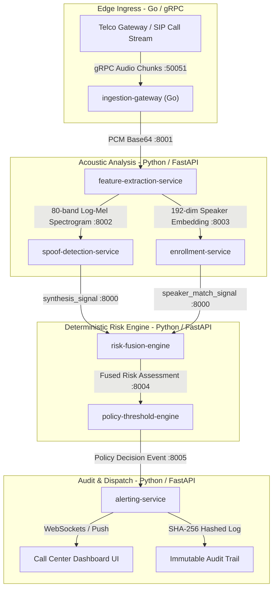

# 🛡️ PrimeVector: Comprehensive SIH Project Briefing
> **Voice Integrity & Impersonation Prevention Platform**  
> *Prepared for SIH 2026 Presentation to Experienced Judges*

---

## 📋 Executive Summary

PrimeVector is a real-time, privacy-preserving, event-driven digital security platform designed to protect banks, enterprise executives, telecommunications operators, and government channels against **AI voice cloning**, **deepfake caller spoofing**, and **voice impersonation fraud**.

Modern generative AI models can clone any individual's voice using as little as a 5-second audio snippet extracted from social media or recorded calls. Human ears can no longer distinguish between genuine human voices and AI-synthesized clones. PrimeVector sits as an automated security firewall between incoming phone calls and target organizations, performing microscopic acoustic analysis, speaker voiceprint verification, and deterministic risk scoring in **under 50 milliseconds**.

---

## 🎯 1. Problem Statement & Solution

### The Threat Landscape
- **Vishing & ATO (Account Takeover):** Fraudsters impersonating account holders over phone calls to reset passwords or bypass OTPs.
- **Executive Impersonation (CEO/CFO Fraud):** AI-cloned voices used in urgent phone calls to authorize high-value corporate wire transfers.
- **Telecom Fraud:** Scaled spoofing attacks targeting call centers.

### The PrimeVector Solution
PrimeVector inspects live audio streams for phase inconsistencies, vocoder artifacts, pitch unnaturalness, and speaker identity mismatches. It computes a unified, mathematically audited **Risk Score (0.0 to 1.0)** and delivers automated recommendation alerts (`RECOMMEND_CALLBACK_VERIFICATION`, `RECOMMEND_SUPERVISOR_ESCALATION`, or `BLOCK_PENDING_VERIFICATION`) before fraud can occur.

---

## 🔄 2. End-to-End System Workflow

### Detailed Step-by-Step Flow

1. **Streaming Audio Ingestion (`ingestion-gateway`):**
   - Telecommunications gateway or SIP server streams 16kHz mono PCM audio chunks via gRPC.
   - Applies tenant token-bucket rate limiting (`golang.org/x/time/rate`) and stream backpressure.

2. **Spectral & Behavioral Scan (`feature-extraction-service`):**
   - Base64 PCM decoded directly in RAM.
   - Computes **80-band Log-Mel Spectrograms** (25ms window, 10ms hop length).
   - Extracts **Prosody Features** ($F_0$ pitch contours, pitch variance, jitter estimates, pause ratios).
   - Generates a **192-dimensional Speaker Embedding Vector** (d-vector / ResNet architecture).
   - **Privacy Invariant:** Raw audio is immediately discarded after feature extraction; **Zero audio is written to disk or database.**

3. **AI Deepfake Detection (`spoof-detection-service`):**
   - Evaluates Log-Mel features against trained neural networks to produce an AI synthesis probability score $s_{\text{synth}} \in [0.0, 1.0]$.
   - Includes **Regional Accent Routing** (`hi-in`, `ta-in`, `te-in`, `bn-in`, `en-generic`) to prevent false-positives across Indian accents.

4. **Voiceprint Verification (`enrollment-service`):**
   - Compares the live speaker embedding vector against enrolled voiceprints using **Cosine Vector Similarity**.
   - Enforces the **Multi-Session Calendar-Day Invariant**: requires registration across $\ge 3$ distinct UTC calendar days with random liveness phrase challenges (e.g. *"blue mountain running clock 847"*).

5. **Risk Fusion Engine (`risk-fusion-engine`):**
   - Combines acoustic evidence signals using a **Noisy-OR Probabilistic Formula**:
     $$P(\text{suspicious}) = 1 - \prod_{s \in \text{signals}} (1 - s.\text{score})$$
   - Applies a **Bounded Contextual Multiplier** ($0.85\times - 1.35\times$) based on transaction risk (e.g. wire transfer amount).
   - Computes final fused risk score: $\text{risk\_score} = \min(1.0, P(\text{suspicious}) \cdot \text{multiplier})$.

6. **Policy Engine (`policy-threshold-engine`):**
   - Maps risk scores to actions (`PROCEED`, `RECOMMEND_CALLBACK_VERIFICATION`, `RECOMMEND_SUPERVISOR_ESCALATION`, `BLOCK_PENDING_VERIFICATION`).
   - Enforces the **Opt-In Auto-Block Liability Gate**: `auto_block_enabled` defaults to `False` so system never unilaterally blocks calls unless explicitly configured.

7. **Idempotent Alerting & Audit (`alerting-service`):**
   - Dispatches notifications to call center dashboards and webhooks.
   - Hashes recipient identities with **SHA-256** for immutable, privacy-compliant audit logging.

---

## 🛠️ 3. Complete Tech Stack & Component Rationale

| Microservice / Component | Tech Stack | Role & Justification |
|---|---|---|
| **ingestion-gateway** | Go 1.22 / gRPC | High-throughput edge ingestion handling 10,000+ concurrent streams with sub-50ms latency, Go goroutines, and token-bucket rate limiting. |
| **feature-extraction-service** | Python 3.10 / FastAPI / Librosa / NumPy | Extracts spectral features, Log-Mel spectrograms, prosody pitch contours, and 192-dim speaker embeddings in transient RAM. |
| **spoof-detection-service** | Python 3.10 / FastAPI / PyTorch / ONNX Runtime | Deep learning acoustic spoofing detection model loader with regional Indian accent routing. |
| **enrollment-service** | Python 3.10 / FastAPI / SciPy | Multi-session voiceprint registration manager, liveness challenge validator, and cosine similarity vector matcher. |
| **risk-fusion-engine** | Python 3.10 / FastAPI / Pydantic | Core compliance brain executing Noisy-OR probabilistic math and bounded context multiplication. |
| **policy-threshold-engine** | Python 3.10 / FastAPI | Tenant-specific policy threshold evaluator with versioned audit trails and opt-in auto-block gate. |
| **alerting-service** | Python 3.10 / FastAPI | Consumer-side idempotent notification dispatcher and SHA-256 privacy audit logger. |
| **SDKs** | Python 3.10+ Package / Node.js TypeScript | Client wrappers allowing banks to integrate PrimeVector in under 10 lines of code. |
| **Frontend Dashboard** | React 18 / Vite / TailwindCSS / Framer Motion | Real-time forensic web interface with live risk gauge visualization, health checks, and policy management. |
| **Deployment & Testing** | Docker, Docker Compose, Pytest, Hypothesis, Go Test | Containerized orchestration with property-based and integration testing suites (200+ passing tests). |

---

## ⚖️ 4. Feasibility & Viability Analysis

### Technical Feasibility
- **Low Latency (<50ms):** gRPC binary streaming and optimized feature extraction ensure real-time evaluation without call delay.
- **Scalability:** Microservices are stateless and containerized, enabling independent autoscaling on Kubernetes (K8s) based on load spikes.
- **Easy Integration:** Seamless SDKs and REST/gRPC interfaces plug directly into Avaya, Cisco, Genesys, or Asterisk SIP gateways.

### Commercial & Operational Viability
- **Zero Liability Gate:** Auto-blocking defaults to `False`. The system recommends actions to human operators (`RECOMMEND_CALLBACK_VERIFICATION`), eliminating bank false-positive liability risks.
- **Regional Indian Accent Support:** Language and accent identification scaffolding prevents false flags caused by Indian speech nuances (`hi-in`, `ta-in`, `te-in`).
- **Privacy Compliance (DPDP & GDPR):** In-memory processing with **Zero Audio Retention** avoids data storage regulations and breach liabilities.

---

## 📈 5. Impact & Benefits

- **Financial Fraud Reduction:** Prevents high-value wire transfer fraud, synthetic voice ATO, and caller ID spoofing attacks.
- **Enhanced Enterprise Trust:** Restores confidence in voice identity verification without requiring lengthier security questioning.
- **Privacy First:** Zero raw audio retention guarantees compliance with India's DPDP Act and global privacy frameworks.

---

## 🛡️ 6. The 5 Hard Security Invariants (For SIH Judges)

1. **Never Fail Open:** On network failure, outage, or missing signals, the system degrades (`degraded: true`) and outputs `RECOMMEND_CALLBACK_VERIFICATION`. It never assumes a call is clean ($0.0$).
2. **Zero Audio Retention:** Raw audio is processed strictly in-memory (RAM) and garbage-collected. No audio bytes are ever saved to disk or logs.
3. **Opt-In Auto-Block Liability Gate:** `auto_block_enabled` defaults to `False`. System surfaces recommendations and never unilaterally blocks unless explicitly configured per tenant.
4. **Noisy-OR Acoustic Evidence Fusion:** Prevents high-risk acoustic signals (e.g. 98% AI synthetic score) from being hidden by simple score averaging.
5. **Multi-Session Calendar-Day Enrollment:** Voiceprints require $\ge 3$ captures on distinct UTC calendar days with random liveness phrase challenges to prevent stolen audio clip registration.

---

## ❓ Quick Q&A Preparation for Judges

* **Q: What if the caller has a background noise or bad network?**
  * *A:* Features are normalized using Log-Mel energy scaling, and pitch micro-variance ($F_0$) is evaluated alongside spectral models to isolate vocal tract features from background static.
* **Q: How do you handle privacy and voice data storage laws?**
  * *A:* We enforce a strict zero raw audio retention policy. Spoken audio exists solely in transient RAM for feature conversion and is immediately destroyed.
* **Q: What if an AI model service goes down?**
  * *A:* Our fail-safe invariant ensures the system degrades gracefully with `degraded: true` and issues a `RECOMMEND_CALLBACK_VERIFICATION` action instead of failing open.
