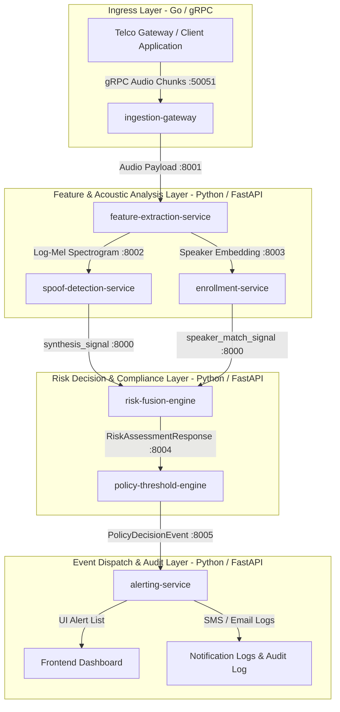
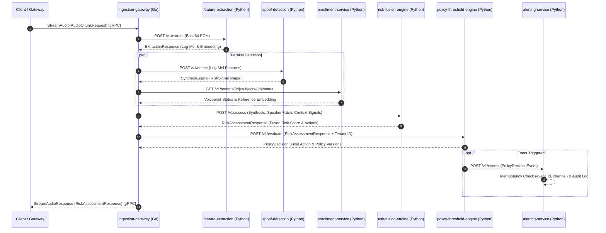

# Complete System Overview & Technical Architecture
## Voice Integrity & Impersonation Prevention Platform

---

# PART 1: Layman's Explanation (For Non-Technical Readers & Stakeholders)

## 💡 What Does This System Do?

Imagine you get a phone call from your bank's CFO, your boss, or a loved one asking you to immediately transfer $50,000 to a new bank account. The voice on the phone sounds **100% identical** to the person you know. 

Today, scammers can use AI tools to clone anyone's voice using just a 5-second audio snippet taken from social media or a past phone call. Human ears can no longer tell the difference between a real human voice and an AI-synthesized voice clone.

**This platform is a real-time digital security guard for phone calls.** 
It listens to live phone calls, detects microscopic acoustic glitches and artificial patterns that human ears miss, checks if the caller's voice matches their official registered voice print, and instantly alerts the bank or call center before money can be stolen.

---

## 🎯 Who Is It Meant For?

1. **Banks & Financial Institutions:** Prevents fraudulent wire transfers, unauthorized password resets, and high-value transaction approvals over phone calls.
2. **Enterprise Executives & CFOs:** Protects privileged corporate decision-makers (CEOs, CFOs, Board Members) from voice-cloning social engineering attacks.
3. **Telecom Operators & Call Centers:** Filters incoming call streams at national scale, flagging suspicious callers before agents transfer sensitive accounts.
4. **Government & High-Security Channels:** Verifies official identities during critical voice communications.

---

## 🔄 How It Works (Step-by-Step Story)

```
[1. Incoming Call]  -->  [2. Sound Scan]  -->  [3. AI Fake Check]  -->  [4. Voice Profile Check]  -->  [5. Security Decision]  -->  [6. Alert Dispatch]
```

1. **The Call Arrives:** A caller dials into a bank or call center.
2. **Sound Scanning (Feature Extraction):** The system breaks down the caller's voice into mathematical sound wave patterns in milliseconds. *Importantly, the system never records or saves your spoken conversation—it analyzes the math and immediately throws the voice recording away.*
3. **AI Fake Detection (Spoof Detector):** An AI model inspects the sound waves for tiny artificial signatures left behind by voice cloning software.
4. **Voice Profile Check (Enrollment Service):** The system compares the caller's voice pattern against a pre-registered "voiceprint" on file to verify if the caller is who they claim to be.
5. **The Master Security Decision (Risk Fusion Engine):** A core security officer combines all clues:
   - *Is the voice computer-generated?*
   - *Does the voice match the real owner's profile?*
   - *Is the caller trying to execute an unusually high-risk transfer?*
6. **Instant Protection (Policy Engine & Alerting):** If the risk is high, the system immediately recommends action (e.g., "Send a text verification code", "Escalate to manager", or "Ask caller to call back on verified line").

---

# PART 2: High-Level Technical Architecture

## 🏗️ System Overview & Microservice Topology

The platform is designed as an event-driven microservice architecture with non-blocking gRPC ingestion at the edge, stateless inference services in the processing layer, and deterministic risk evaluation at the decision layer.



---

## 🔑 Core Design Principles & Architectural Invariants

### 1. Fail-Safe Guarantee (Never Fail Open)
If any service, model, or database fails or times out, the system **never** assumes the call is clean (score = 0.0). It degrades gracefully to `degraded: true` and outputs a recommendation for secondary manual verification (`RECOMMEND_CALLBACK_VERIFICATION`).

### 2. Privacy by Design (Zero Audio Retention)
Raw audio exists strictly in transient RAM during feature extraction. It is **never** written to disk, database tables, or log files.

### 3. Noisy-OR Acoustic Evidence Fusion
Acoustic evidence signals (AI synthesis probability and speaker identity mismatch) are combined using a **Noisy-OR** probability formulation so that a high threat in one signal is never diluted by averaging with another.

### 4. Bounded Contextual Multiplier
Contextual metadata (e.g., transfer amount, device risk) acts strictly as a **bounded multiplier ($0.85\times - 1.35\times$)** on acoustic evidence. Context alone can never accuse someone of voice fraud without acoustic evidence.

### 5. Opt-In Auto-Block Liability Gate
`auto_block_enabled` defaults to `False` for every tenant. Unless a tenant explicitly opts into automatic blocking, the system surfaces recommendations (`RECOMMEND_*`) to human decision-makers and **never** unilaterally blocks transactions.

---

# PART 3: Low-Level Technical Architecture & Internal Mechanics

Below is the exhaustive service-by-service specification detailing data structures, algorithms, mathematical formulas, and internal workflows.



---

## 🔍 Service Deep-Dives

### 1. `ingestion-gateway` (Go 1.22 / gRPC)

* **Primary Responsibilities:** High-throughput streaming ingress, tenant token-bucket rate limiting, stream buffer backpressure management, regional context extraction.
* **Network Binding:** gRPC `:50051`, Health/Metrics `:8080`
* **Internal Mechanics:**
  * **gRPC Method:** `rpc StreamAudio(stream AudioChunkRequest) returns (stream RiskAssessmentResponse)`
  * **Rate Limiter:** Token-bucket rate limiter per tenant using `golang.org/x/time/rate`. Exceeding bucket returns gRPC status `ResourceExhausted` (Code 8).
  * **Backpressure Mechanism:** Incoming chunks enter a bounded Go channel `chan *pb.AudioChunkRequest` of depth `StreamBufferDepth` (default: 8). When downstream processing slows, non-blocking select records `telemetry.GlobalMetrics.IncBackpressureEvents()` and applies natural TCP/gRPC backpressure to the client stream.
  * **Fail-Safe Fallback:** If downstream processing times out (`DownstreamTimeout`), `downstream.BuildFailsafeResponse()` constructs a fallback response with `degraded: true` and `RECOMMEND_CALLBACK_VERIFICATION`.

---

### 2. `feature-extraction-service` (Python 3.10+ / FastAPI)

* **Primary Responsibilities:** Spectral feature extraction and speaker embedding generation.
* **Network Binding:** HTTP REST `:8001`
* **Internal Mechanics:**
  * **Endpoint:** `POST /v1/extract`
  * **Input Payload:** `ExtractionRequest` (Base64 audio PCM, sample rate 16kHz, mono channel).
  * **Processing Pipeline:**
    1. Base64 decoded to raw PCM bytes in RAM.
    2. Log-Mel Spectrogram generated: 80 mel bands, 10ms hop length, 25ms window length.
    3. Speaker Embedding generated: 192-dimensional vector via d-vector / ResNet architecture.
  * **Privacy Guarantee:** Audio bytes are processed entirely in memory and garbage-collected. Pydantic models contain no `audio_bytes` response field.

---

### 3. `spoof-detection-service` (Python 3.10+ / FastAPI)

* **Primary Responsibilities:** Acoustic AI synthesis detection, language/accent cluster identification, shadow-mode model evaluation.
* **Network Binding:** HTTP REST `:8002`
* **Internal Mechanics:**
  * **Endpoint:** `POST /v1/detect`
  * **Language/Accent Classifier:** Inspects input spectral features and routes request to accent-cluster specific model variants (`en-generic`, `hi-in`, `ta-in`, `te-in`, `bn-in`).
  * **Confidence Scoring Formula:** Computes confidence from model logit output $z$:
    $$\text{score} = \sigma(z) = \frac{1}{1 + e^{-z}}$$
    $$\text{confidence} = 2 \cdot |\text{score} - 0.5|$$
  * **Fail-Safe Mode:** If no model is registered or inference fails, returns `available: false` with detail `"No model registered"`.

---

### 4. `enrollment-service` (Python 3.10+ / FastAPI)

* **Primary Responsibilities:** Voiceprint registration, liveness challenge verification, multi-session day checks, revocation management.
* **Network Binding:** HTTP REST `:8003`
* **Internal Mechanics:**
  * **Endpoints:**
    - `POST /v1/tenants/{id}/enroll`
    - `POST /v1/tenants/{id}/subjects/{id}/session`
    - `POST /v1/tenants/{id}/subjects/{id}/revoke`
    - `GET /v1/tenants/{id}/subjects/{id}/status`
  * **Multi-Session Calendar-Day Invariant:** Requires $\ge 3$ capture sessions on **distinct calendar days (UTC)** before updating status from `NOT_ENROLLED` to `ENROLLED`. Sessions submitted on the same UTC day raise HTTP 409 Conflict.
  * **Liveness Challenge:** Server generates a dynamic random challenge phrase (e.g. *"blue mountain running clock 847"*). The session must pass `LivenessChecker.verify()` or it is rejected and not counted toward enrollment.
  * **Revocation Audit Trail:** Revoking a voiceprint records an immutable `AuditEntry` with actor identity, timestamp, and reason code.

---

### 5. `risk-fusion-engine` (Python 3.10+ / FastAPI)

* **Primary Responsibilities:** Core audited compliance math, evidence signal fusion, action recommendation, explanation generation.
* **Network Binding:** HTTP REST `:8000`
* **Internal Mechanics:**
  * **Endpoint:** `POST /v1/assess`
  * **Math Rule 1 — Noisy-OR Fusion:** Combines available acoustic signals ($s_{\text{synth}}$ and $s_{\text{speaker}}$):
    $$P(\text{suspicious}) = 1 - \prod_{s \in \text{available}} (1 - s.\text{score})$$
  * **Math Rule 2 — Contextual Multiplier:** Maps contextual score $s_{\text{context}} \in [0.0, 1.0]$ onto a bounded scale $[0.85, 1.35]$:
    $$\text{multiplier} = 0.85 + s_{\text{context}} \cdot (1.35 - 0.85)$$
    $$\text{fused\_risk\_score} = \min\left(1.0, P(\text{suspicious}) \cdot \text{multiplier}\right)$$
  * **Action Selection Thresholds:**
    - Score $\ge 0.70 \implies \text{RECOMMEND\_SUPERVISOR\_ESCALATION}$ & $\text{RECOMMEND\_CALLBACK\_VERIFICATION}$
    - Score $\ge 0.40 \implies \text{RECOMMEND\_CALLBACK\_VERIFICATION}$ or $\text{RECOMMEND\_MFA\_STEP\_UP}$
    - Score $< 0.40 \implies \text{PROCEED}$

---

### 6. `policy-threshold-engine` (Python 3.10+ / FastAPI)

* **Primary Responsibilities:** Tenant-specific rule thresholds, opt-in auto-block gate, versioned policy updates, immutable configuration audit logs.
* **Network Binding:** HTTP REST `:8004`
* **Internal Mechanics:**
  * **Endpoints:** `POST /v1/evaluate`, `GET/PUT /v1/tenants/{id}/policy`, `GET /v1/tenants/{id}/audit-log`
  * **Auto-Block Safety Invariant:** `auto_block_enabled` defaults to `False`. The auto-block decision is evaluated as:
    ```python
    if config.auto_block_enabled and risk_score >= config.block_threshold:
        return "BLOCK_PENDING_VERIFICATION"
    ```
    If `auto_block_enabled == False`, this branch is unreachable, and maximum score 1.0 returns `RECOMMEND_SUPERVISOR_ESCALATION`.
  * **Policy Versioning:** Any edit to thresholds or flags increments `policy_version` and generates an immutable per-field `AuditLogEntry`.

---

### 7. `alerting-service` (Python 3.10+ / FastAPI)

* **Primary Responsibilities:** Pub/Sub event consumption, consumer-side idempotency suppression, multi-channel notification dispatching, privacy-preserving audit logging.
* **Network Binding:** HTTP REST `:8005`
* **Internal Mechanics:**
  * **Endpoints:** `POST /v1/events`, `GET /v1/tenants/{id}/alerts`, `GET /v1/tenants/{id}/audit`
  * **Idempotency Gate:** Suppresses duplicate notifications based on `(event_id, channel)`:
    ```python
    if delivery_store.has_delivered(event.event_id, channel.name):
        return  # Skip duplicate
    ```
  * **Retry Execution:** Single retry attempt on failure without backoff.
  * **Privacy Hashing:** Recipient identifiers are hashed using SHA-256 before writing to the audit log:
    $$\text{recipient\_hash} = \text{SHA256}(\text{raw\_recipient\_string})$$

---

## ⚙️ Microservice Data Contracts Summary

| Service | Consumes | Produces |
|---|---|---|
| `ingestion-gateway` | `AudioChunkRequest` (gRPC Stream) | `RiskAssessmentResponse` (gRPC Stream) |
| `feature-extraction-service` | `ExtractionRequest` (JSON) | `ExtractionResponse` (Log-Mel & Embedding) |
| `spoof-detection-service` | `SpoofDetectionRequest` (JSON) | `SynthesisSignalResponse` (RiskSignal shape) |
| `enrollment-service` | `SubmitSessionRequest` (Base64 + Challenge) | `SubmitSessionResponse` (Voiceprint Status) |
| `risk-fusion-engine` | `RiskAssessmentRequest` (3 RiskSignals) | `RiskAssessmentResponse` (Fused Score & Actions) |
| `policy-threshold-engine` | `EvaluateRequest` (RiskAssessmentInput) | `PolicyDecision` (Final Action & Policy Version) |
| `alerting-service` | `PolicyDecisionEventIn` (PubSub / REST) | `AlertOut` & Hashed `AuditEntryOut` |
